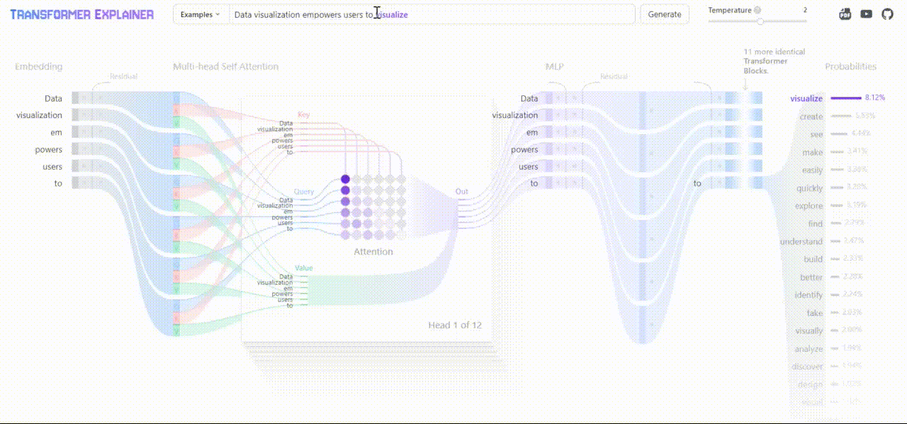

 

<small> 

[▸LinkedIn](https://www.linkedin.com/in/kunalkolhe3/)  ║ [▸Portfolio](https://kunalk3.github.io/Portfolio-Website-Kunalk3/)  ║ [▸GitHub](https://github.com/kunalk3/)  ║ [▸Gmail](https://mail.google.com/mail/?view=cm&fs=1&tf=1&to=kunalkoleh333@gmail.com)  ║ [▸Facebook](https://www.facebook.com/kunal.kolhe98/)  ║ [▸Instagram](https://www.instagram.com/kkunalkkolhe/) 

__Owner:__ @Kunal K

 </small>
 

---

__Introduction-__
This blog provides the references for AI-ML model visualization, architecture understanding, key components and data flow in better way.

- __Transformer Explainer__ (Transformer, Architecture, Embeddings, Attention models, MLP)
- __Diffusion Explainer__ (Stable Diffusion, Image upscale, Image refine)
- __CNN Explainer__ (CNN, Pooling, Kernel, Stride, Fully coonected network)
- __NLP Models for Sentiment Analysis__ (BERT, RoBERTa, DistilBERT, ALBERT, XLNet)

---

__📌 A) Transformer Explainer: Interactive Learning of Text-Generative Models:__

Transformer Explainer is an interactive visualization tool designed to help anyone learn how Transformer-based models like GPT work. It runs a live GPT-2 model right in your browser, allowing you to experiment with your own text and observe in real time how internal components and operations of the Transformer work together to predict the next tokens. Try Transformer Explainer at http://poloclub.github.io/transformer-explainer and watch a demo video on YouTube https://youtu.be/ECR4oAwocjs .

    

[▸Demo](https://poloclub.github.io/transformer-explainer/)  ║ [▸GitHub](https://github.com/poloclub/transformer-explainer)  ║ [▸Paper](https://arxiv.org/abs/2408.04619)  ║ [▸Video](https://www.youtube.com/watch?v=ECR4oAwocjs)  

---

__📌 B) Diffusion Explainer:__

Stable Diffusion is a text-to-image model that transforms a text prompt into a high-resolution image. Stable Diffusion first changes the text prompt into a text representation, numerical values that summarize the prompt. The text representation is used to generate an image representation, which summarizes an image depicted in the text prompt. This image representation is then upscaled into a high-resolution image.

    

[▸Demo](https://poloclub.github.io/diffusion-explainer/)  ║ [▸GitHub](https://github.com/poloclub/diffusion-explainer)  ║ [▸Paper](https://arxiv.org/abs/2305.03509)  ║ [▸Video](https://www.youtube.com/watch?v=Zg4gxdIWDds)  ║ [▸Blog](https://medium.com/polo-club-of-data-science/stable-diffusion-explained-for-everyone-77b53f4f1c4) 

---

__📌 C) CNN  Explainer:__

A CNN is a neural network: an algorithm used to recognize patterns in data. Neural Networks in general are composed of a collection of neurons that are organized in layers, each with their own learnable weights and biases.

    

[▸Demo](https://poloclub.github.io/cnn-explainer/)  ║ [▸GitHub](https://github.com/poloclub/cnn-explainer)  ║ [▸Paper](https://arxiv.org/abs/2004.15004)  ║ [▸Video](https://www.youtube.com/watch?v=HnWIHWFbuUQ) 

---
__📌 D) NLP Models for Sentiment Analysis__ BERT, RoBERTa, DistilBERT, ALBERT, XLNet:

Sentiment analysis is a crucial task in Natural Language Processing (NLP) that aims to determine the sentiment expressed in a given text. It has applications in various domains, including social media monitoring, customer feedback analysis, and market research.

__1. BERT (Bidirectional Encoder Representations from Transformers)__

- Core concept: BERT is a transformer-based model that learns deep bidirectional representations by jointly conditioning on both left and right context in all layers.

- Sentiment analysis: BERT excels at capturing complex linguistic patterns and contextual nuances, making it highly effective for sentiment analysis. It can handle various sentiment expressions, including sarcasm, irony, and multiple sentiments within a single text.

__2. RoBERTa (Robustly Optimized BERT Approach)__

- Core concept: RoBERTa is a BERT-based model that incorporates several training improvements, such as dynamic masking, larger batch sizes, and longer training time.

- Sentiment analysis: Building upon BERT's strengths, RoBERTa often achieves superior performance in sentiment analysis tasks due to its enhanced training regimen. It can better handle diverse text formats and sentiment complexities.

__3. DistilBERT (Distilled BERT)__

- Core concept: DistilBERT is a smaller, faster, and cheaper version of BERT, created through knowledge distillation. It retains most of BERT's performance while being more efficient.

- Sentiment analysis: DistilBERT offers a good balance between performance and efficiency, making it suitable for resource-constrained environments or real-time applications. It can effectively classify sentiments with reasonable accuracy.

__4. ALBERT (A Lite BERT)__

- Core concept: ALBERT focuses on parameter reduction techniques to create a more efficient BERT-like model. It employs factorized embedding parameterization and cross-layer parameter sharing.

- Sentiment analysis: ALBERT demonstrates strong performance in sentiment analysis while requiring fewer computational resources compared to BERT. It can handle various text lengths and sentiment granularities.

__5. XLNet__

- Core concept: XLNet is a generalized autoregressive pre-training method that overcomes limitations of BERT by allowing for permutation language modeling. It can model both the left and right context of a word.

- Sentiment analysis: XLNet often exhibits competitive performance in sentiment analysis, especially when dealing with ambiguous or complex sentiment expressions. It can capture long-range dependencies and contextual information effectively.

 [▸GitHub](https://github.com/kunalk3/Prep-And-Practice/blob/main/Blogs/Assets/ref_pdf/NLP%20models%20-%20Sentiment%20Analysis%20(BERT%2C%20RoBERTa%2C%20DistilBERT%2C%20ALBERT%2C%20XLNet)1.pdf)  ║ [▸Paper](https://github.com/kunalk3/Prep-And-Practice/blob/main/Blogs/Assets/ref_pdf/NLP%20models%20-%20Sentiment%20Analysis%20(BERT%2C%20RoBERTa%2C%20DistilBERT%2C%20ALBERT%2C%20XLNet)1.pdf) 
 
---

