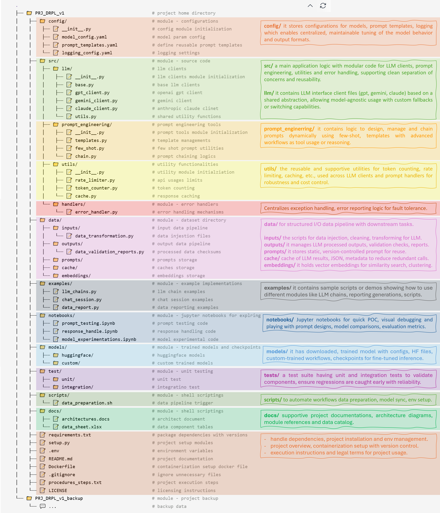

<small> <center>

[▸LinkedIn](https://www.linkedin.com/in/kunalkolhe3/) <a href="https://www.linkedin.com/in/kunalkolhe3/" target="blank"></a> ║ [▸Portfolio](https://kunalk3.github.io/Portfolio-Website-Kunalk3/) <a href="https://kunalk3.github.io/Portfolio-Website-Kunalk3/" target="blank"></a> ║ [▸GitHub](https://github.com/kunalk3/) <a href="https://github.com/kunalk3/" target="blank"></a> ║ [▸Gmail](https://mail.google.com/mail/?view=cm&fs=1&tf=1&to=kunalkoleh333@gmail.com) <a href="https://mail.google.com/mail/?view=cm&fs=1&tf=1&to=kunalkoleh333@gmail.com" target="blank"></a> ║ [▸Facebook](https://www.facebook.com/kunal.kolhe98/) <a href="https://www.facebook.com/kunal.kolhe98/" target="blank"></a> ║ [▸Instagram](https://www.instagram.com/kkunalkkolhe/) <a href="https://www.instagram.com/kkunalkkolhe/" target="blank"></a>

__Owner:__ @Kunal K

</center> </small>

---

__📌 Key features of the GenAI project structure:__ <br>
✅ __config/:__ YAML files for all configurations, keeping your settings separate from the code. <br>
✅ __src/:__ Modularized core source code with logical components like llm/and prompt_engineering/. <br>
✅ __data/:__ A well-organized storage solution for data types such as embeddings and prompts. <br>
✅ __examples/:__ Sample scripts for implementation guidance, such as chat sessions or prompt chaining. <br> 
✅ __notebook/:__ Jupyter notebooks for experimentation and analysis.  <br>
✅ __models/:__ Trained models or custom HF models, weights, checkpoints for fine tuning. <br>
✅ __test/:__ overall unit tests and integration tests with workflow validations.<br>
✅ __scripts/:__ scripts to automate workflow, trigger points, environmental setup scripts.<br>
✅ __docs/:__ Project documentations including architecture, overview, data sheets, procedures. <br>
 
__📌 Folder structure:__
<div align="center">
    
</div>

__📌 Best practice implementations for Gen AI developments:__ <br>
1️⃣ Use YAML files in __config/__ to keep configurations clean and separate from code. <br>
2️⃣ Organize modular components like llm,  prompt_engineering, utility under __src/__ for scalable development. <br>
3️⃣ Store embeddings, prompts and related assets in __data/__ for structured data management. <br>
4️⃣ Provide reference implementations in __examples/__ to guide usage like prompt chaining or chat sessions. <br>
5️⃣ Use __notebook/__ with Jupyter notebooks to quickly experiments, tests and validate ideas. <br>
6️⃣ Store fine-tuned models, checkpoints, and weights in __models/__ for reproducibility. <br>
7️⃣ Add unit and integration tests in __test/__ to ensure workflow reliability and quality assurance. <br>
8️⃣ Automate workflows and setups using shell and python scripts in __scripts/__. <br>
9️⃣ Maintain clear and thorough documentation in __docs/__ including architecture, procedures, and data flow. <br>

```bash
    .                                       
    ├── 📁 PRJ_DRPL_v1                                 # project home directory
    │    ├── 📁 config/                                # module - configurations
    │    │    ├── 📝 __init__.py                       # config module initialization
    │    │    ├── 📝 model_config.yaml                 # model param config
    │    │    ├── 📝 prompt_templates.yaml             # define reusable prompt templates
    │    │    └── 📝 logging_config.yaml               # logging settings
    │    ├── 📁 src/                                   # module - source code
    │    │    ├── 📁 llm/                              # llm clients
    │    │    │    ├── 📝 __init__.py                  # llm clients module initialization
    │    │    │    ├── 📝 base.py                      # base llm clients
    │    │    │    ├── 📝 gpt_client.py                # openai gpt client
    │    │    │    ├── 📝 gemini_client.py             # gemini client
    │    │    │    ├── 📝 claude_client.py             # anthropic claude clinet
    │    │    │    └── 📝 utils.py                     # shared utility functions
    │    │    ├── 📁 prompt_engineering/               # prompt engineering tools
    │    │    │    ├── 📝 __init__.py                  # prompt tools module initialization
    │    │    │    ├── 📝 templates.py                 # template managements
    │    │    │    ├── 📝 few_shot.py                  # few shot prompt utilities
    │    │    │    └── 📝 chain.py                     # prompt chaining logics
    │    │    ├── 📁 utils/                            # utility functionalities
    │    │    │    ├── 📝 __init__.py                  # utility module initialziation
    │    │    │    ├── 📝 rate_limiter.py              # api usages limits
    │    │    │    ├── 📝 token_counter.py             # token counting
    │    │    │    └── 📝 cache.py                     # response caching
    │    │    └── 📁 handlers/                         # module - error handlers
    │    │         └── 📝 error_handler.py             # error handling mechanisms 
    │    ├── 📁 data/                                  # module - dataset directory
    │    │    ├── 📁 inputs/                           # input data pipeline
    │    │    │    └── 📝 data_transformation.py       # data injestion files
    │    │    ├── 📁 outputs/                          # output data pipeline 
    │    │    │    └── 📝 data_validation_reports.py   # processed data checksums
    │    │    ├── 📁 prompts/                          # prompts storage
    │    │    ├── 📁 cache/                            # caches storage
    │    │    └── 📁 embeddings/                       # embeddings storage
    │    ├── 📁 examples/                              # module - example implementations
    │    │    ├── 📝 llm_chains.py                     # llm chain examples
    │    │    ├── 📝 chat_session.py                   # chat session examples
    │    │    └── 📝 data_report.py                    # data reporting examples
    │    ├── 📁 notebooks/                             # module - jupyter notebooks for explring
    │    │    ├── 📝 prompt_testing.ipynb              # prompt testing code
    │    │    ├── 📝 response_handle.ipynb             # response handling code
    │    │    └── 📝 model_experimentations.ipynb      # model experimental code
    │    ├── 📁 models/                                # module - trained models and checkpoints
    │    │    ├── 📁 huggingface/                      # huggingface models
    │    │    └── 📁 custom/                           # custom trained models
    │    ├── 📁 test/                                  # module - unit testing
    │    │    ├── 📁 unit/                             # unit test
    │    │    └── 📁 integration/                      # integratino test
    │    ├── 📁 scripts/                               # module - shell scriptings
    │    │    └── 📝 data_preparation.sh               # data pipeline trigger
    │    ├── 📁 docs/                                  # module - shell scriptings
    │    │    ├── 📝 architectures.docs                # architect document
    │    │    └── 📝 data_sheet.xlsx                   # data component tables
    │    ├── 📝 requirements.txt                       # package dependencies with versions
    │    ├── 📝 setup.py                               # project setup modules
    │    ├── 📝 .env                                   # environment variables
    │    ├── 📝 README.md                              # project documentation
    │    ├── 📝 Dockerfile                             # containerization setup docker file
    │    ├── 📝 .gitignore                             # ignore unnecessary files
    │    ├── 📝 procedures_steps.txt                   # project execution steps
    │    └── 📝 LICENSE                                # licensing instructions
    └── 📁 PRJ_DRPL_v1_backup                          # module - project backup
         └── 💬 ...                                    # backup data
```

__📌 Overview in detail (files level):__ 
- **📁 config/**
  - **📄 __ init__.py:** Initializes the config package to allow importing of config modules easily across the project.
  - **📄 model_config.yaml:** Stores parameters like model name, temperature, top_p, max_tokens etc., to configure LLM behavior without hardcoding.
  - **📄 prompt_templates.yaml:** Defines reusable prompt formats/templates (e.g., few-shot, instruction-based) for consistency and maintainability.
  - **📄 logging_config.yaml:** Centralizes logging configuration—format, level, handlers (console/file)—used throughout the project for unified logging.
- **📁 src/**
  - **📁 llm/**
  - **📄 __init__.py:** Marks the llm module as a Python package, enabling modular imports of clients.
  - **📄 base.py:** Defines abstract base class for LLM clients, enforcing a common interface (e.g., generate_response()).
  - **📄 gpt_client.py:** Implements OpenAI GPT API interaction logic (e.g., ChatCompletion.create()), extending the base client.
  - **📄 gemini_client.py:** Handles interaction with Google's Gemini models (e.g., using VertexAI APIs or Gemini SDK).
  - **📄 claude_client.py:** Connects to Anthropic Claude APIs, enabling you to send prompts and get completions.
  - **📄 utils.py:** Houses shared functions for all LLM clients—authentication helpers, retries, formatting.
  - 📁 prompt_engineering/
  - **📄 __init__.py:** Initializes the prompt_engineering package.
  - **📄 templates.py:** Manages loading, parsing, and rendering of prompt templates defined in YAML or stored locally.
  - **📄 few_shot.py:** Contains logic to construct few-shot prompts—adding context examples before queries.
  - **📄 chain.py:** Handles chaining logic—connecting multiple LLM calls to enable multi-step reasoning or task decomposition.
  - **📁 utils/**
  - **📄 __init__.py:** Initializes the utility module for easy import of utility tools.
  - **📄 rate_limiter.py:** Implements rate limiting to avoid exceeding LLM API usage limits (e.g., using time.sleep, tokens/sec constraints).
  - **📄 token_counter.py:** Counts tokens in prompts/responses using model-specific encoding to manage token limits and optimize costs.
  - **📄 cache.py:** Stores previous LLM responses to avoid redundant API calls, improving performance and cost-efficiency.
  - **📁 handlers/**
  - **error_handler.py:** Captures and handles exceptions—API errors, invalid prompts, rate limit issues—providing safe fallback logic.
- **📁 data/**
  - **📁 inputs/**
  - **data_transformation.py:** Processes raw data into clean, structured format usable by prompts or LLMs (e.g., text extraction, formatting).
  - **📁 outputs/**
  - **data_validation_reports.py:** Validates LLM output—checking formatting, presence of expected fields, and correctness heuristics.
  - **📁 prompts/:** Stores saved prompts, organized by use case (e.g., summarization, classification, Q&A), for reuse or versioning.
  - **📁 cache/:** Contains cached responses and intermediate data files to reduce repeated computation.
  - **📁 embeddings/:** Stores generated vector embeddings from text using models like OpenAI, Hugging Face, or custom ones.
- **📁 examples/**
  - **📄 llm_chains.py:** Shows how to use chained prompts (multi-step logic) in a real-world scenario.
  - **📄 chat_session.py:** Demonstrates implementing an interactive chat flow using LLM clients and prompt templates.
  - **📄 data_report.py:** Example of generating structured reports using LLM outputs, useful for business or analytics use cases.
- **📁 notebooks/**
  - **📄 prompt_testing.ipynb:** Notebook to interactively test different prompt structures and observe model behavior.
  - **📄 response_handle.ipynb:** Demonstrates how to parse, clean, or validate responses from the LLM.
  - **📄 model_experimentations.ipynb:** Used for running comparative experiments with different models, configs, or prompts.
- **📁 models/**
  - **📁 huggingface/:** Stores downloaded or fine-tuned Hugging Face models (e.g., BERT, T5) and configs.
  - **📁 custom/:** Stores your own trained or fine-tuned models—PyTorch/TF model weights, tokenizer configs, etc.
- **📁 test/**
  - **📁 unit/:** Contains unit tests for small modules or functions (e.g., token counting, prompt building).
  - **📁 integration/:** Tests how modules work together—LLM integration, prompt chains, caching.
- **📁 scripts/**
  - **📄 data_preparation.sh:** Shell script to automate the data ingestion and transformation pipeline.
- **📁 docs/**
  - **📄 architectures.docs:** Describes the architecture of the GenAI system, its modules, data flow, and responsibilities.
  - **📄 data_sheet.xlsx:** Excel sheet listing datasets, fields, sources, and related metadata.
- **📁 Other Root Files**
- **📄 requirements.txt:** Lists all Python libraries required to run the project (e.g., openai, langchain, pandas, PyYAML).
- **📄 setup.py:** Python setup script to package and install the project locally or via pip.
- **📄 .env:** Stores sensitive environment variables (API keys, secrets, etc.) loaded at runtime.
- **📄 README.md:** Project introduction, setup steps, usage examples, and contact/contribution info.
- **📄 Dockerfile:** Creates a containerized environment for the project (with dependencies and runtime setup).
- **📄 .gitignore:** Defines files/folders to exclude from version control (e.g., __pycache__, .env, logs, cache).
- **📄 procedures_steps.txt:** Lists step-by-step instructions to run the project from setup to execution and testing.
- **📄 LICENSE:** Specifies the open-source license (MIT, Apache, etc.) governing how the project can be used or modified. 

---

<div align="left">

</div>
